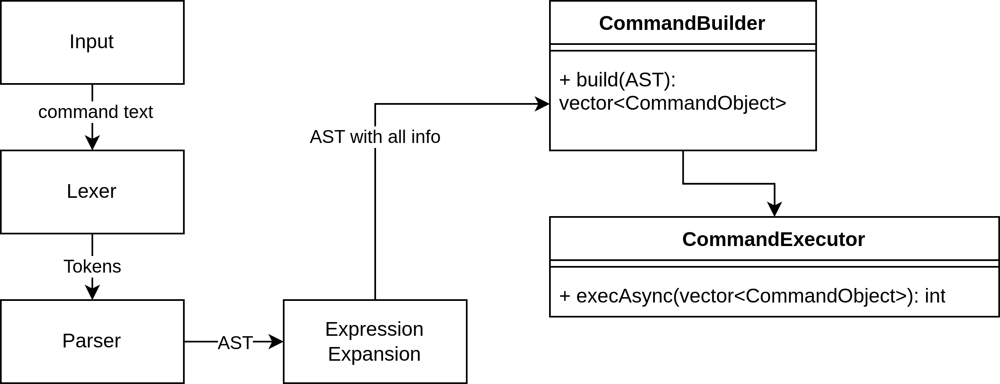

# Bash C++ (cli-sd-team2-cpp)

Простой интерпретатор командной строки, поддерживающий команды:
* 🐱 `cat [FILE]` – выводит содержимое файла на экран
* 😱 `echo` – выводит на экран свои аргументы
* 🚽 `wc [FILE]` – выводит количество строк, слов и байт в файле
* 🎁 `pwd` – выводит текущую директорию
* 🚪 `exit` – выходит из интерпретатора
* 🔍 `grep` – программа для поиска шаблонов в файлах
  * **Usage:**
      `grep [option]... [pattern] [file]`
  * **Флаги:**
      - `-i` – выполнять поиск без учёта регистра
      - `-c` – выводить только количество выбранных строк
      - `-l` – выводить только имена файлов, содержащих выбранные строки
      - `-w` – искать выражение как отдельное слово
      - `-A num` – вывести `num` строк последующего контекста после каждого совпадения

## Архитектура


## Возможности

* Конвейеры (оператор `|`).
* Переменные сессии.
* Присваивание переменных (`=`).
* Подстановка переменных (`$`).
* Переменные окружения.
* Экранирование (`'`, `"`).
* Вызов внешних процессов - **TODO**.


## Начало работы

### Предварительные требования

* C++ standart 17.

### Запуск программы

#### Компиляция и запуск

##### Способ 1: Через CMake (рекомендуемый)

```bash
# Клонирование репозитория
git clone https://github.com/username/project.git
cd project

# Создание директории для сборки
mkdir build && cd build

# Конфигурация и компиляция
cmake ..
make -j$(nproc)

# Запуск программы
./bin/MyProject
```

##### Способ 2: Прямая компиляция g++
```bash
g++ -std=c++17 -o myprogram src/main.cpp src/**/*.cpp -Iinclude
./myprogram
```

## ✨ Качество кода

### Автоматические проверки

В проекте настроены автоматические проверки стиля кода и статический анализ:

#### 🔍 clang-format (стиль кода)
- Конфигурация основана на **Google Style** с настройками из `.clang-format`
- Отступы: 4 пробела
- Длина строки: 100 символов
- Проверяется при каждом PR — неотформатированный код не будет принят

```bash
# Автоматическое форматирование
make format
# или
./scripts/format.sh
```

#### ⚡ cppcheck (статический анализ)
- Поиск утечек памяти
- Проверка выхода за границы массивов
- Анализ неинициализированных переменных
- Проверка производительности

```bash
# Запуск анализатора
make analyze
```

## Тестирование

Проект использует **Google Test** для модульного тестирования. Все тесты находятся в директории `/tests` и автоматически запускаются при каждом push в любой ветке и pull request в main через GitHub Actions.

### Запуск тестов локально

```bash
# Сборка и запуск всех тестов
mkdir build && cd build
cmake ..
make
ctest --output-on-failure

# Или запуск конкретного теста
./tests/myproject_tests --gtest_filter=ModuleName.*
```

## Непрерывная интеграция (CI)

Используется GitHub Actions (`.github/workflows/tests.yml`). Запускается при push в ветки и pull request в `main`. Выполняет сборку и тестирование.
